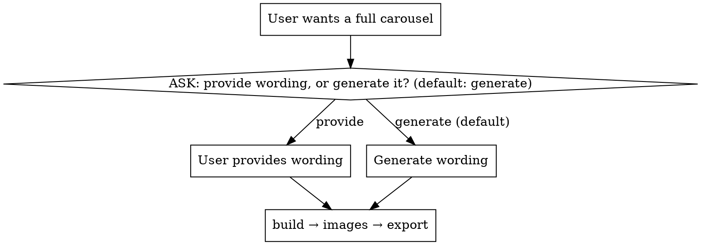

# Creating an ALA carousel end-to-end

## Overview

Orchestrate the four carousel skills into one run: **wording → HTML slider → images → exported PNG + PDF.** This skill owns only the *sequencing and the one branch*; each stage's real work (and its own verification) belongs to its sub-skill — invoke them, don't reimplement them.

Core principle: **ask one question first (supply wording, or generate it?) with "Generate it for me" as the preselected default, then run the pipeline straight through to the export without inventing your own checkpoints.**

## The one decision — ask it BEFORE anything else

Do **not** start researching, building, or generating until you've asked. Ask via the `AskUserQuestion` tool with **"Generate it for me" as the first (recommended) option** so it is preselected. For example:

- Question: *"Should I generate the slide wording, or will you provide it?"*
- Header: `Wording`
- Options (in this order):
  1. **Generate it for me (Recommended)** — invoke the concept skill to research and draft the slides.
  2. **I'll provide the wording** — paste slide copy (stat + caption + source per slide).

## Workflow

1. **[ASK] Supply or generate?** Ask via `AskUserQuestion` with "Generate it for me" listed first as the recommended/default option. Nothing else first.
2. **Get the wording:**
   - **Provide path** → give the user room to paste their slide copy (stat + caption + source per slide). Take it as the fixed input. **Skip the concept skill entirely.** This path is topic-agnostic — the wording need not be about chicken farming.
   - **Generate path** → invoke **`chicken-farming-carousel-concept`**. It runs its *own* internal asks (country, then anchor stat, then final-wording approval). Let those happen — they are expected, not checkpoints you added. Use its finalized wording.
3. **[AUTO] Build the slider.** Invoke **`building-carousel-slider`** with the wording → `carousels/<slug>/index.html` + one image `.md` spec per slide.
4. **[AUTO] Generate the images.** Invoke **`generating-carousel-images`** → transparent cut-out PNGs into `images/`. (Spends OpenAI image API budget — that is expected, not a reason to pause.)
5. **[AUTO] Export.** Invoke **`exporting-carousel-slider`** → `export/slide-N.png` + `<slug>.pdf`.
6. **Report** the deliverable paths.

## Run straight through

Once the wording is settled (provided or generated), run steps 3→5 with **no approval stops of your own.** Each sub-skill verifies itself by rendering — trust those gates instead of asking "looks good?" between stages.

The only legitimate interruptions are: the step-1 question; the concept skill's built-in asks on the generate path; and a **genuine blocker** you must surface (e.g. missing `OPENAI_API_KEY`, or a sub-skill's verify step failing) — report it, don't silently skip the stage.

## Common mistakes

| Mistake | Fix |
|---|---|
| Diving into research/HTML before asking | Ask supply-or-generate first, always |
| Running the concept skill on the provide path | Skip it; the user's wording IS the input |
| Suppressing the concept skill's own asks | Those (country, anchor, final wording) are expected — let them run |
| Adding "approve the HTML?" / "ready to spend on images?" stops | Run 3→5 straight through; you chose this design |
| Reimplementing a stage's logic | Invoke its skill via the Skill tool |
| Exporting before images exist | Order is fixed: build → images → export |
| Silently skipping image gen when the API key is missing | Surface it as a blocker and stop |

## The sub-skills (invoke, don't duplicate)

- `chicken-farming-carousel-concept` — generates ALA slide wording (generate path only).
- `building-carousel-slider` — wording → HTML slider + per-image specs.
- `generating-carousel-images` — specs → transparent cut-out PNGs.
- `exporting-carousel-slider` — slider → PNG-per-slide + multi-page PDF.
